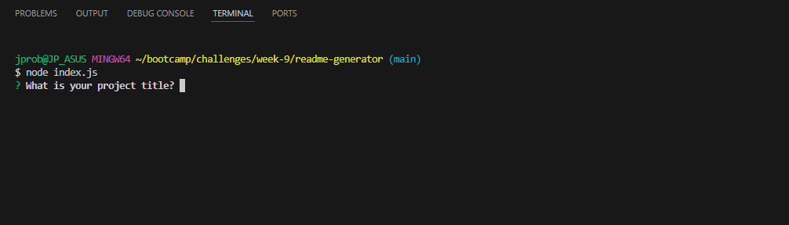
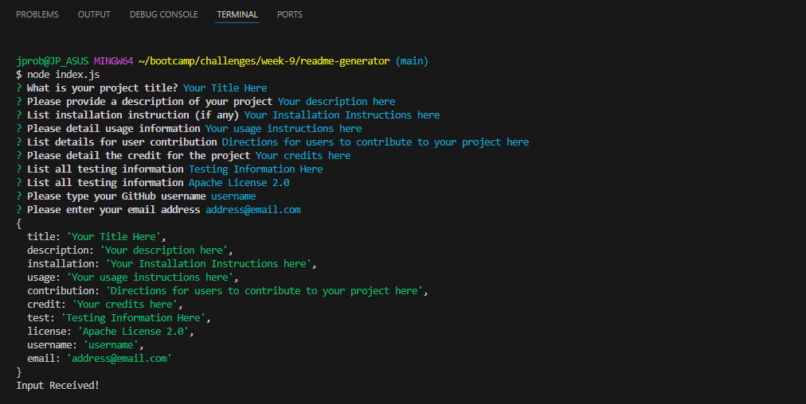

# README Generator

## Description

Every project needs a professional README to help document information about the project, and to help users interface with the application/website/product itself.

Sometimes it can be difficult to create a new README from scratch, so I've programmed a tool that should make this process a lot easier!

Using Node.js, NPM, and Inquirer, this application lets users answer prompts via the terminal that will then be passed into the JavaScript file. From there, a new README.md file will be created with all of the information that has been input from the user.

While completing this project, I learned about how best to utilize different forms of input for inquirer, and making sure any NPM dependencies were taken care of.

## Installation

Clone the repository, and make sure you have both Node.js and NPM Inquirer (v8.2.4) installed.

In Git Bash, run "node index.js" to start the process.

## Usage

Once the code has been cloned, and you've ensured that both Node.js and NPM Inquirer (v8.2.4), in the terminal, run "node index.js"

Follow the series of prompts that show up in the terminal, and input information about your project accordingly.

Once all prompts have been answered, the terminal will show an object showcasing your answers, followed by the text "Input Received!"

a new markdown file titled "newREADME.md" will be created in the project - formatted with your answers

    

## Credits

Application functionality designed by me, James Probel, with starter code and guidelines provided by the Programming Bootcamp of UNC Chapel Hill

## License

N/A
